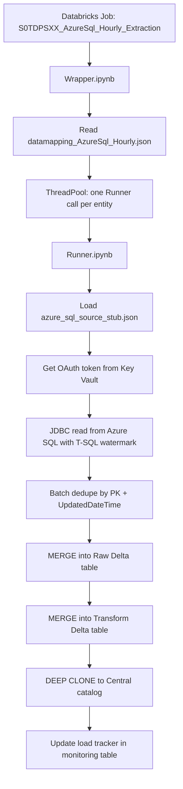

# Azure SQL → Delta Implementation Guide

This document explains **what we changed**, **where**, **in what order**, and **why**, for loading `dbo.SiteOverrideStandard` and `dbo.ADGroup` from Azure SQL into Delta tables in the **TDPTSXX-DATALAKE** framework.

**Repo path:** `TDPTSXX-DATALAKE/src/`  
**Scope:** Dev environment only (POC). Oracle → Delta pipelines are unchanged.

---

## Overall Flow



### End-to-end sequence (one entity run)

1. **Job** sets `DataMapping_File=./datamapping_AzureSql_Hourly.json` and starts `Wrapper`.
2. **Wrapper** loads the JSON, loops `SiteOverrideStandard` and `ADGroup`, calls `Runner` in parallel.
3. **Runner** parses entity config, loads Azure SQL connection stub, builds incremental T-SQL.
4. **jdbc_utils** obtains a service-principal access token and reads via JDBC.
5. **Dedupe** keeps the latest row per primary key in the batch.
6. **Raw layer** MERGEs into `ent_dtlk_dev.<schema>_raw.<Entity>`.
7. **Transform layer** MERGEs into `ent_dtlk_dev.<schema>_transform.<Entity>`.
8. **Clone** copies to Central region catalog (same pattern as Oracle hourly loads).
9. **Monitor** updates `ent_dtlk_dev.monitoring.load_tracking_s0transportxxx`.

---

## Target Tables (Dev)

| Azure SQL Source | Raw Delta | Transform Delta |
|------------------|-----------|-----------------|
| `dbo.SiteOverrideStandard` | `ent_dtlk_dev.transportation_facility_raw.SiteOverrideStandard` | `ent_dtlk_dev.transportation_facility_transform.SiteOverrideStandard` |
| `dbo.ADGroup` | `ent_dtlk_dev.transportation_reference_raw.ADGroup` | `ent_dtlk_dev.transportation_reference_transform.ADGroup` |

**Incremental watermark:** `UpdatedDateTime`  
**Primary keys:** `SiteOverrideStandardID`, `ADGroupID`

---

## Changes Made (Sequential Order)

Implement and explain in this order when presenting to stakeholders.

---

### Step 1 — Shared Azure SQL connection config

**File added:** `src/azure_sql_source_stub.json` (entire file, ~40 lines)

**What:** Connection and authentication settings for Azure SQL using **service principal** auth (server, database, tenant, client ID, Key Vault scope, secret key).

**Why:** Oracle entities use per-entity `URL` / `NHA` / `PasswordSecret`. Azure SQL entities share one TDPS SQL database and SP credentials (same pattern as `TDPS-DBWS-Dataload`).

**Key fields:**
- Lines 5–18: `server_by_env`, `database_by_env`, JDBC driver
- Lines 20–38: SP auth via Key Vault secret `database-sp-sec`

---

### Step 2 — Entity mapping for the two Azure SQL tables

**File added:** `src/datamapping_AzureSql_Hourly.json` (entire file, ~95 lines)

**What:** Two entity definitions following the existing `datamapping_Hourly.json` shape, plus Azure SQL–specific fields.

**Why:** Keeps Azure SQL loads isolated from Oracle hourly mappings. The job points at this file via `DataMapping_File`.

| Entity block | Lines (approx.) | Purpose |
|--------------|-----------------|---------|
| `SiteOverrideStandard` | 1–47 | Facility/reference override table |
| `ADGroup` | 48–95 | AD group reference table |

**New config fields (both entities):**

| Field | Example | Why |
|-------|---------|-----|
| `DBType` | `AzureSQL` | Tells Runner to use SP/JDBC path instead of Oracle |
| `Source_Connection_Config` | `./azure_sql_source_stub.json` | Shared connection file |
| `Dedupe_Key_Columns` | PK column | Batch dedupe partition key |
| `Dedupe_Order_Columns` | `UpdatedDateTime,CreatedDateTime` | Latest row wins |
| `Raw_Merge_On_Primary_Key` | `Y` | Raw layer uses MERGE, not append |

**SQL blocks (lines 8, 54):** T-SQL `SELECT ... FROM dbo.<Table> WHERE 1=1` — the `WHERE 1=1` suffix allows Runner to append the incremental watermark clause.

---

### Step 3 — JDBC utilities for Azure SQL

**File added:** `src/utils/jdbc_utils.py` (entire file, ~240 lines)

**What:** Reusable helpers ported/adapted from `TDPS-DBWS-Dataload/src/utils/jdbc_utils.py`, extended for datalake Runner needs.

**Why:** Runner previously only supported Oracle username/password from Key Vault. Azure SQL requires OAuth token-based JDBC.

| Function | Lines (approx.) | Purpose |
|----------|-----------------|---------|
| `is_azure_sql_db_type()` | 38–40 | Detect Azure SQL entities |
| `load_json_config()` | 43–45 | Load connection stub |
| `_get_sql_server_access_token()` | 68–128 | SP token from Azure AD |
| `build_sql_server_jdbc_options()` | 131–170 | JDBC URL + accessToken |
| `read_jdbc_dataframe()` | 173–204 | Unified JDBC read (Azure SQL or Oracle) |
| `dedupe_dataframe()` | 207–221 | Layer 1 batch dedupe |
| `build_merge_condition()` | 224–229 | PK merge predicate |
| `merge_dataframe_into_delta()` | 232–240 | Layer 2/3 Delta MERGE |
| `format_sql_server_watermark()` | 243–250 | T-SQL datetime literal formatting |

---

### Step 4 — Wire utilities into Runner

**File modified:** `src/Runner.ipynb`

#### 4a. New cell — import jdbc_utils

**Cell index:** 2 (inserted after logging setup)

**What added:**
```python
# MAGIC %run ./utils/jdbc_utils
```

**Why:** Makes all Azure SQL helper functions available to Runner without duplicating token/JDBC logic.

---

#### 4b. `get_arguments()` — parse Azure SQL config

**Cell:** `get_arguments` (notebook JSON lines ~118–176)

**What changed:**

| Change | Lines (approx.) | Why |
|--------|-----------------|-----|
| Read `Dedupe_Key_Columns`, `Dedupe_Order_Columns`, `Raw_Merge_On_Primary_Key` | 123–125 | Config-driven dedupe and raw merge |
| Load `Source_Connection_Config` via `load_json_config()` | 127–131 | Azure SQL connection at runtime |
| Oracle `URL`/`keyvault`/`NHA` only when **not** Azure SQL | 133–141 | Azure entities don't have Oracle fields |
| Added fields to returned `args` dict | 168–174 | Downstream functions use same args object |

---

#### 4c. `create_sql_statement()` — T-SQL incremental filter

**Cell:** `create_sql_statement` (lines ~755–763)

**What changed:**

```python
elif is_azure_sql_db_type(args['dbtype']):
    watermark = format_sql_server_watermark(_time)
    sqlstmt = f"{args['jdbc_sql']} AND {args['source_incremental_identifier_col']} > CAST('{watermark}' AS datetime2)"
```

**Why:** Previous `else` branch used invalid `timestamp_format()` (not valid T-SQL). Azure SQL needs `CAST(... AS datetime2)`.

Oracle branch unchanged (`to_timestamp(...)`).

---

#### 4d. `persist_new_data()` — read, dedupe, raw merge

**Cell:** `persist_new_data` (lines ~968–995)

**What changed:**

| Change | Lines (approx.) | Why |
|--------|-----------------|-----|
| Replace inline Oracle JDBC with `read_jdbc_dataframe()` | 968–971 | Supports Azure SQL SP auth |
| Call `dedupe_dataframe()` after read | 973 | Layer 1 dedupe before any write |
| Raw write: conditional MERGE when `Raw_Merge_On_Primary_Key=Y` | 983–995 | Layer 2 — avoids duplicate PKs on raw (old code always appended) |

**First-run behavior:** If raw table does not exist, Runner creates it and uses overwrite/append (same as before). MERGE applies on subsequent incremental runs when the table exists.

---

#### 4e. `persist_new_data()` — transform path updates

**Cell:** same `persist_new_data` (lines ~1030–1044)

**What changed:**

| Change | Lines (approx.) | Why |
|--------|-----------------|-----|
| Initial transform load uses `read_jdbc_dataframe()` + dedupe | 1030–1036 | Azure SQL full load for new transform tables |
| Hourly transform merge uses `build_merge_condition()` + `merge_dataframe_into_delta()` | 1040–1044 | Reuses shared merge helper (Layer 3) |

Oracle hourly transform behavior preserved; Azure SQL follows the same merge path.

---

### Step 5 — Databricks job definition

**File modified:** `src/databricks.yml`

#### 5a. Base job resource

**Lines ~105–117** (under `resources.jobs`)

**What added:** `S0TDPSXX_AzureSql_Hourly_Extraction`
- Task runs `Wrapper` notebook
- Library: `com.microsoft.sqlserver:mssql-jdbc:12.6.1.jre11` (Maven)

**Why:** Oracle JDBC jar (`ojdbc7.jar`) cannot connect to Azure SQL. Microsoft JDBC driver required.

#### 5b. DEV_East target override

**Lines ~180–224** (under `targets.DEV_East.resources.jobs`)

**What added:** Full job definition for dev:
- Schedule: hourly at `:15:12` ET (`12 15 * * * ?`), **PAUSED** for safe POC
- `DataMapping_File: ./datamapping_AzureSql_Hourly.json`
- Smaller cluster (`num_workers: 4`)

**Why:** Dev-only POC — not added to Tst/Stg/Prd/Central targets yet.

---

### Step 6 — Files intentionally NOT changed

| File | Why unchanged |
|------|----------------|
| `Wrapper.ipynb` | Already config-driven via `DataMapping_File` env var |
| `Deploy.yml` / `Deploy_Template.yml` | Existing bundle deploy works; job deploys with `databricks bundle deploy` |
| Oracle `datamapping_*.json` | Separate source system |
| `TDPS-DBWS-Dataload/*` | Different pipeline (Oracle → Azure SQL) |

---

## Three-Layer Deduplication (Design)

| Layer | Where implemented | File / function |
|-------|-------------------|-----------------|
| **1. Batch dedupe** | After JDBC read | `jdbc_utils.dedupe_dataframe()` — `row_number()` over PK, order by `UpdatedDateTime DESC, CreatedDateTime DESC` |
| **2. Raw Delta MERGE** | Before transform | `Runner.persist_new_data()` when `Raw_Merge_On_Primary_Key=Y` |
| **3. Transform MERGE** | Hourly transform | `merge_dataframe_into_delta()` on transform path |

**Not handled:** Hard deletes in Azure SQL (rows removed at source won't appear in incremental watermark loads). Would need a separate reconcile job (similar to `Trip_Delete_Detection`).

---

## How to Run (Dev)

1. Deploy bundle from `src/`:
   ```bash
   databricks bundle deploy -t DEV_East
   ```
2. In Databricks UI, open job **S0TDPSXX Azure SQL Hourly Extraction**.
3. Run once manually (job starts **PAUSED**).
4. Verify:
   - Raw/transform tables in `ent_dtlk_dev`
   - Load tracker rows for `SiteOverrideStandard` and `ADGroup`
   - Central clone tables in `entc_dtlk_dev`

---

## Prerequisites Checklist

- [ ] UC schemas exist: `transportation_facility_raw/transform`, `transportation_reference_raw/transform`
- [ ] SP `cgbdaprgsqls0tdpsxx01` has `SELECT` on both dbo tables
- [ ] Key Vault `cutdkyvtdbwss0tdpsxx01` accessible; secret `database-sp-sec` present
- [ ] Cluster/job service principal can read Key Vault and write to UC/ADLS paths

---

## File Change Summary

| # | Action | File |
|---|--------|------|
| 1 | **Added** | `src/azure_sql_source_stub.json` |
| 2 | **Added** | `src/datamapping_AzureSql_Hourly.json` |
| 3 | **Added** | `src/utils/jdbc_utils.py` |
| 4 | **Modified** | `src/Runner.ipynb` (new cell + 4 functions updated) |
| 5 | **Modified** | `src/databricks.yml` (new job, dev target only) |
| 6 | **Added** | `AZURE_SQL_TO_DELTA_IMPLEMENTATION.md` (this document) |

---

## Presenting the Story (Suggested Narrative)

1. **Problem:** Operational data already lives in Azure SQL; analytics needs it in Delta Lake.
2. **Approach:** Extend existing Wrapper/Runner pattern — no new orchestration framework.
3. **Config first:** Connection stub + entity mapping JSON (Steps 1–2).
4. **Plumbing:** JDBC utils for SP auth (Step 3).
5. **Runner enhancements:** T-SQL watermark, dedupe, raw merge (Step 4).
6. **Operationalize:** Dev Databricks job with SQL JDBC driver (Step 5).
7. **Result:** Hourly incremental Azure SQL → Raw → Transform → Clone, with load tracking.
